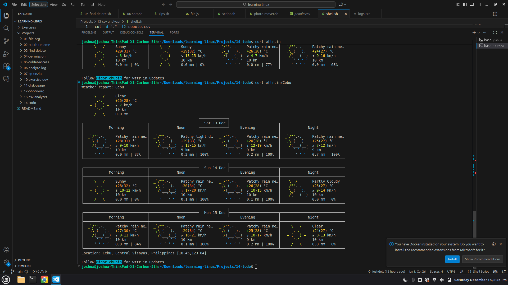

### Core Linux
```
ls           # list files
ls -la       # list all with permision
cd -         # change dir
cd ..        # go back
cd /         # root
pwd          # current location
mkdir mydir  # create new folder
rm file.txt  # delete file
rm -r folder # delete folder
cp src dest  # copy
mv src dest  # move/rename
```

### System Software
```
sudo apt update
sudo apt upgrade
sude apt install <package>    # install 
sudo apt remove <package>     # unistall
```

### Permission
chmod +x file             # make executable
chmod 755 file            # common for scripts
chown user:user file      # change owner

### Process Management
ps aux                      # list running processess
top                         # live system monitor
htop                        # nicer monitor
kill <PID>                  # stop process
kill -9 <PID>               # force kill

### Editing 
nano myfile.txt             # simple editor
vim myfile.txt              # powerful editor
cat file                    # view file
less file                   # view long files

### Networking 
ping google.com
ifconfig                    # or: ip addr
curl url
wget url

### Weater
curl wttr.in/Tagum

